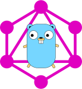

# GGql 

A GraphQL implementation for a GraphQL API that is easy to use and
understand while still providing good performance.
[![License][License-Image]][License-Url] [![FOSSA Status][Fossa-Image]][Fossa-Url]  [![ReportCard][ReportCard-Image]][ReportCard-Url]  [![Coverage][Coverage-Image]][Coverage-Url]
## Features

 - Simple binding of GraphQL schema elements to golang types and functions.
 - Multiple resolver options including dynamic resolvers.
 - High performance
 - No external dependencies.

## News

- The first release is out! Benchmarks look good, documentation is
  complete, and examples available.

## Using

The examples provide the best explanation for how to use the package.

 - [Examples](examples/README.md) of each resolver approach.
   - [Reflection Resolver Example](examples/reflection/README.md)
   - [Interface Resolver Example](examples/interface/README.md)
   - [Root Resolver Example](examples/root/README.md)

## Installation

```
go get github.com/uhn/ggql
```

To build and install the `ggqlgen` application:

```
go install ./...
```

## Releases

See [CHANGELOG.md](CHANGELOG.md)

## Benchmarks

Benchmarks are against
[graphql-go](https://github.com/graphql-go/graphql) which is currently
the most common golang GraphQL package. The ggql-i package is using
the interface resolvers (Resolver and ListResolver) while the ggql
framework is using reflection. For a more comprehensive comparison go
to
[graphql-benchmarks](https://github.com/the-benchmarker/graphql-benchmarks).

#### Parameters
- Last updated: 2020-06-10
- OS: Linux (version: 5.7.1-050701-generic, arch: x86_64)
- CPU Cores: 12
- Connections: 1000
- Duration: 20 seconds
- Units:
  - Rates are in requests per second.
  - Latency is in milliseconds.
  - Verbosity is the number of non-blank lines of code excluding comments.

### Rate
| Language | Framework(version) | Rate | Median Latency | Average Latency | 90th % | 99th % | Std Dev | Verbosity |
| -------- | ------------------ | ----:| ------------:| ---------------:| ------:| ------:| -------:| ---------:|
| go (1.14) | [ggql-i](https://github.com/uhn/ggql) (1.0.0) | **205058** | 0.062 | 0.060 | 0.068 | 0.088 | 0.02 | 253 |
| go (1.14) | [ggql](https://github.com/uhn/ggql) (1.0.0) | **201986** | 0.062 | 0.057 | 0.066 | 0.073 | 0.02 | 176 |
| go (1.14) | [graphql-go](https://github.com/graphql-go/graphql) (0.7.9) | **32843** | 0.078 | 0.075 | 0.086 | 0.102 | 0.03 | 378 |

### Latency
| Language | Framework(version) | Rate | Median Latency | Average Latency | 90th % | 99th % | Std Dev | Verbosity |
| -------- | ------------------ | ----:| ------------:| ---------------:| ------:| ------:| -------:| ---------:|
| go (1.14) | [ggql-i](https://github.com/uhn/ggql) (1.0.0) | 205058 | **0.062** | 0.060 | 0.068 | 0.088 | 0.02 | 253 |
| go (1.14) | [ggql](https://github.com/uhn/ggql) (1.0.0) | 201986 | **0.062** | 0.057 | 0.066 | 0.073 | 0.02 | 176 |
| go (1.14) | [graphql-go](https://github.com/graphql-go/graphql) (0.7.9) | 32843 | **0.078** | 0.075 | 0.086 | 0.102 | 0.03 | 378 |

### Verbosity
| Language | Framework(version) | Rate | Median Latency | Average Latency | 90th % | 99th % | Std Dev | Verbosity |
| -------- | ------------------ | ----:| ------------:| ---------------:| ------:| ------:| -------:| ---------:|
| go (1.14) | [ggql](https://github.com/uhn/ggql) (1.0.0) | 201986 | 0.062 | 0.057 | 0.066 | 0.073 | 0.02 | **176** |
| go (1.14) | [ggql-i](https://github.com/uhn/ggql) (1.0.0) | 205058 | 0.062 | 0.060 | 0.068 | 0.088 | 0.02 | **253** |
| go (1.14) | [graphql-go](https://github.com/graphql-go/graphql) (0.7.9) | 32843 | 0.078 | 0.075 | 0.086 | 0.102 | 0.03 | **378** |


## More Information

 - [Overview](overview.md) of the package and how to use it.
 - [FAQ](faq.md)
 - [Go Docs](https://uhn.github.io/ggql)

[License-Url]: https://www.apache.org/licenses/LICENSE-2.0
[License-Image]: https://img.shields.io/badge/License-Apache2-blue.svg
[ReportCard-Url]: https://goreportcard.com/report/uhn/ggql
[ReportCard-Image]: https://goreportcard.com/badge/github.com/uhn/ggql
[Fossa-Url]: https://app.fossa.com/projects/git%2Bgithub.com%2FUHN%2Fggql?ref=badge_shield
[Fossa-Image]: https://app.fossa.com/api/projects/git%2Bgithub.com%2FUHN%2Fggql.svg?type=shield
[Coverage-Url]: https://coveralls.io/github/UHN/ggql?branch=master
[Coverage-Image]: https://coveralls.io/repos/github/UHN/ggql/badge.svg?branch=master
