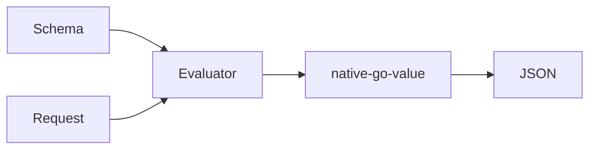

# GraphQL Implementation

The use of the package starts with creating a root object. Next the
root is used to load a GraphQL schema file which must be in SDL
format. Instances of schema types are created to capture the schema
information as the SDL file is parsed. A second pass is made over the
object to setup references or pointers to the correct types. The first
parsing pass generates place holders if the referenced GraphQL type
has not been loaded yet. Finally validation is performed. Validation
includes GraphQL validation as well as a check of any go types
referenced by directives in the schema file.

Requests can be either SDL or JSON. Both are parsed into document
types that validated against the schema. After a successful validation
the resolve processing is started.

There are three alternatives for resolving a document into a JSON
result. One uses a single resolver function. Another uses a Resolver
interface and the third mkes use of reflection to marshal the request
data into function calls on specific go types. In each case the
results of the resolving are used to for a tree that is then converted
to JSON. 

### Schema Types

The schema types includes the types that represent the GraphQL schema
including GraphQL types, scalars, enums, directives, and others that
are defined in a SDL document. These types are parsed from an SDL file
and can be used to generate an SDL.

### Query, Mutation, and Subscriptions Types

The Query, Mutation, and Subscriptions are the requests that can be
made to the package and are referred to as documents or document
types. The doc types are evaluated to for responses to requests
whether those responses be immediate or for subscriptions deferred
until events occur. These types include fragments, queries, mutations,
and others.

### Values

The result of resolving a document are referred to as the values. The
value types all map to a JSON type. Any scalar that does not map
directly is mapped as a string. The Time scalar is an example of
that. The scalar types all implement functions that coerce input as
well as function output values into an internal type. The JSON()
function of each will generate the appropriate value suitable for
conversion to response JSON.

The value types as golang types are:

 - map[string]interface{}
 - []interface{}
 - float64
 - int64
 - string
 - boolean
 - nil
